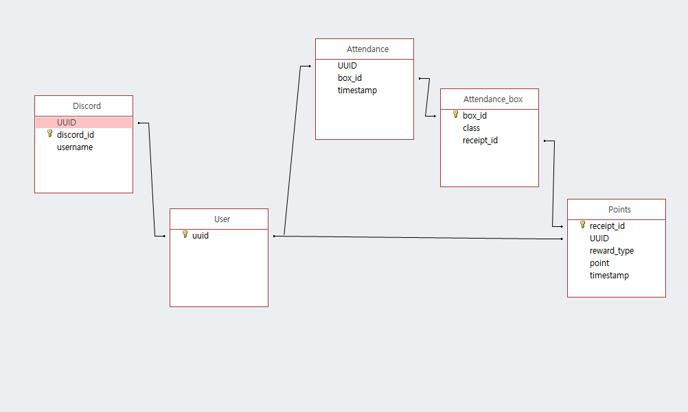

# Database Data Types

## Basic Info
- DBMS: `PostgreSQL (>=9.6)`

## Tables
> References

### User
| Field Name | Data Type | Meta | Description |
|:----------:|:---------:|:----:|:------------|
UUID | UUID | PK | 팀 크레센도에서 일괄 관리하는 유저 고유ID

### Discord
| Field Name | Data Type | Meta | Description |
|:----------:|:---------:|:----:|:------------|
UUID | UUID | FK(User.UUID) | 디스코드 계정과 연결된 유저 고유ID
discord_id | VARCHAR(18) | *NOT NULL* | 디스코드 계정의 고유ID (Managed by Discord)
username | VARCHAR(30) | *NOT NULL* | 디스코드 계정의 글로벌 닉네임

### Attendance
| Field Name | Data Type | Meta | Description |
|:----------:|:---------:|:----:|:------------|
UUID | UUID | FK(User.UUID) | 출석한 사람의 고유ID
box_id | INTEGER | FK(Attendance_box.box_id) | 출석상자의 ID
date | DATE | *NOT NULL* | 출석한 날짜

### Attendance_box
| Field Name | Data Type | Meta | Description |
|:----------:|:---------:|:----:|:------------|
box_id | INTEGER | PK, AUTOINC | 출석 상자의 ID
class | CHARACTER(1) | *NOT NULL* | 출석 상자의 등급 (A, B, C)
receipt_id | INTEGER | FK(Points.receipt_id), *NULLABLE* | 출석 상자를 열었을 때 보상한 영수증 ID

### Points
| Field Name | Data Type | Meta | Description |
|:----------:|:---------:|:----:|:------------|
receipt_id | INTEGER | PK, AUTOINC | 영수증ID
UUID | UUID | FK(User.UUID) *NOT NULL* | 결제자의 고유ID
reward_type | VARCHAR(5) | *NOT NULL* | 결제의 종류 *ex. 후원, 이용권 구매, 출석 보상*
point | INTEGER | *NOT NULL* | 변동된 포인트 값
timestamp | TIMESTAMP | *NOT NULL*, DEFAULT now() | 결제 처리시각
